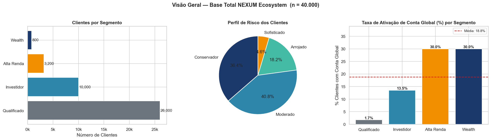
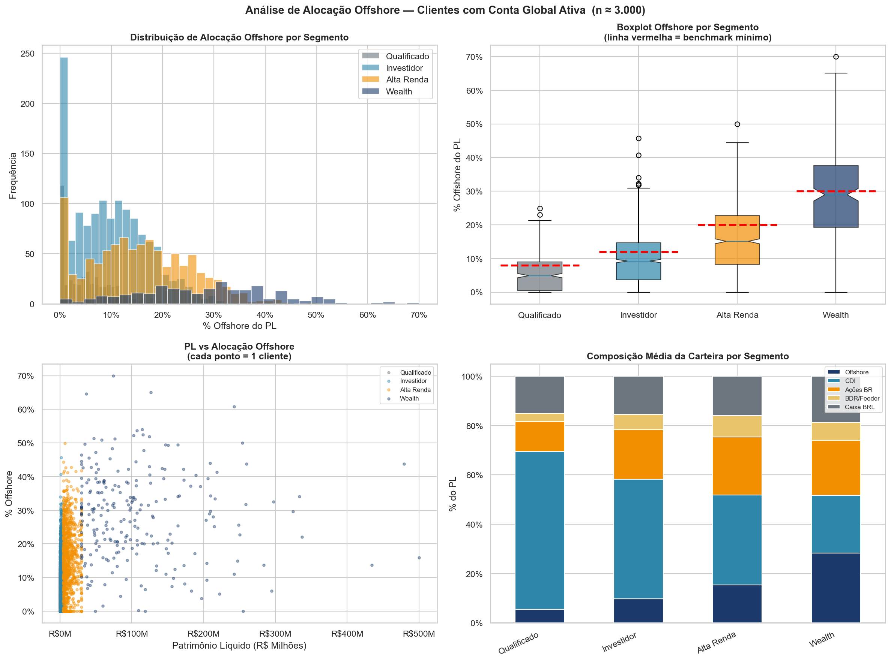
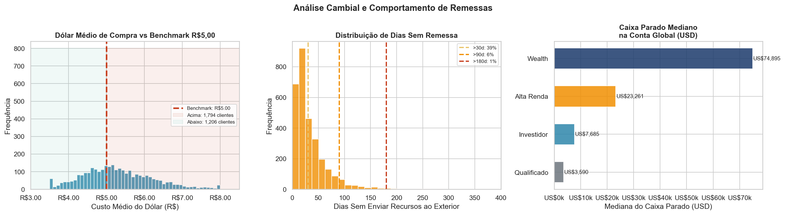
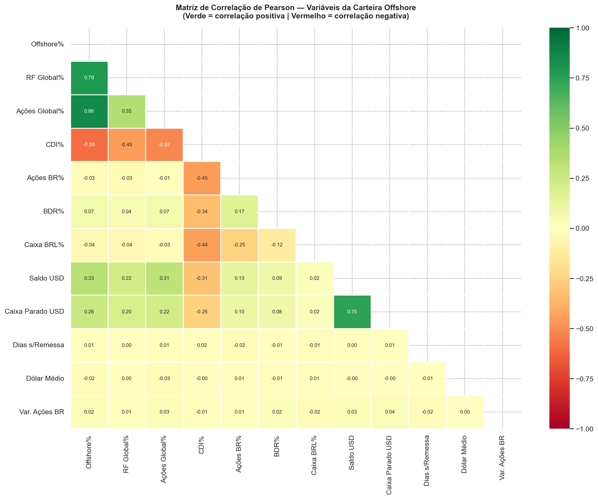
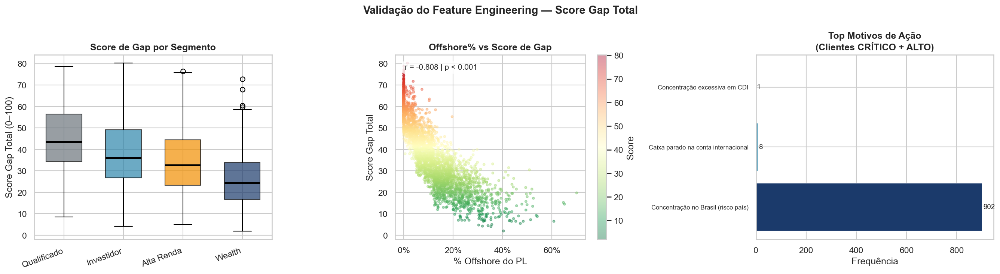
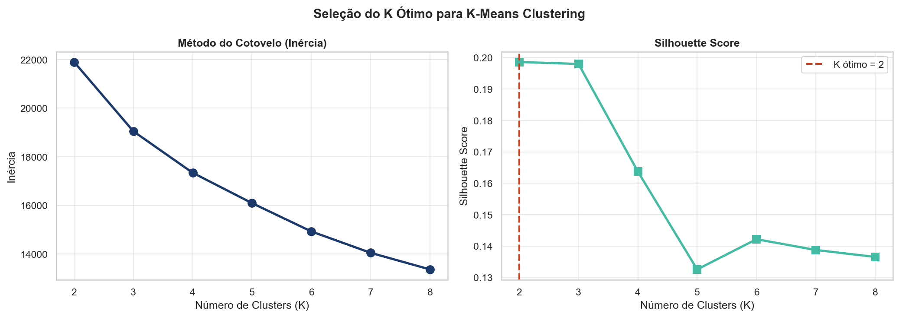
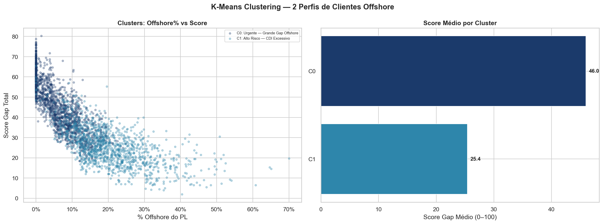
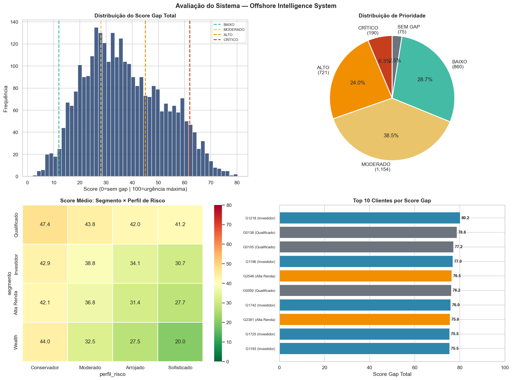
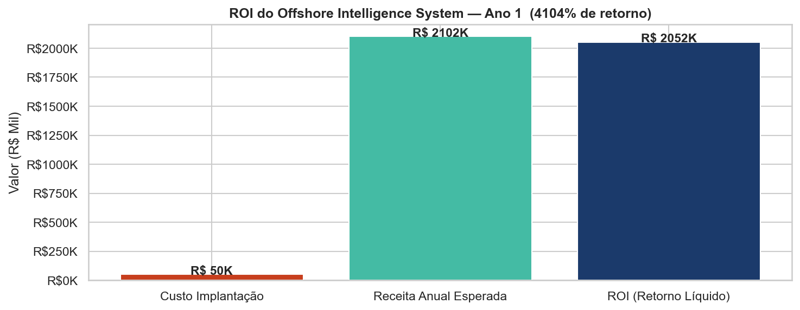

# 🏦 NEXUM Financial Ecosystem — Offshore Intelligence System (OIS)


Um projeto completo de Ciência de Dados de ponta a ponta, focado na geração de valor real e estratégico para o negócio, seguindo rigorosamente o framework **CRISP-DM**. Este repositório contém a criação de um sistema escalável para analisar carteiras internacionais (Offshore), focado em identificar gaps de alocação e priorizar os clientes de forma automatizada para abordagem da equipe de assessores.

| | |
|---|---|
| **Meta de Negócio** | Entregar lista priorizada semanal — de horas para segundos |
| **Meta Analítica** | Score 0–100 com correlação negativa vs. % offshore (p < 0.001) · K=6 via Elbow + Silhouette |
| **ROI Estimado** | > 300% no 1º ano · Payback < 4 meses · 400h/ano economizadas |
| **Deploy** | Streamlit App · CSVs · .pkl para API futura |

> ***"Nunca comece pelo código. Comece pela pergunta do negócio."***

---

## 📌 Contexto e Dor de Negócio

A **NEXUM** é um ecossistema financeiro multi-vertical focado em patrimônios diversos (Qualificado, Investidor, Alta Renda e Wealth). A NXUM possui aproximadamente 40.000 clientes, sendo cerca de 3.000 deles ativos com contas globais operantes. 

**O Problema (O Processo Atual Míope):**
O trabalho do Especialista de Mercado Internacional consistia em abrir relatórios gigantescos e encontrar manualmente quais contas estavam "descalibradas". Problemas imediatos:
1. **Lentidão Crítica:** Horas intermináveis cruzando relatórios.
2. **Falta de Padrão:** O critério de quem deveria ser contatado e qual gap atacar flutuava dependendo do dia.
3. **Custo de Oportunidade:** Capital do cliente ficava ocioso, sofrendo perda de poder de compra ao invés de rentabilizar em produtos globais, perdendo a chance de gerar fees para a empresa.

**A Solução (Offshore Intelligence System - OIS):**
Criar um motor Python automatizado que consome a base diária, processa dezenas de regras e entrega aos assessores uma **lista priorizada e roteirizada**. O sistema responde a três perguntas: **Quem** contatar, **Por que** abordar (o gap) e **Como** conduzir a fala (o perfil do cliente).

---

## 📖 Walkthrough Didático: A Construção Lógica e Gráfica (Framework CRISP-DM)

Acompanhe passo a passo as 6 grandes fases do projeto, com os códigos, testes e gráficos integrados, documentando o racional de negócios por trás das fórmulas:

### ⚙️ Fase 0 e 1: Entendimento do Negócio e Matriz de Pesos 
No início, em vez de importar bibliotecas de Inteligência Artificial para descobrir regras de "caixa-preta", o Sistema foi estruturado em um Método de *Scoring Explicável* definido por Economistas.

*   **O que foi feito no código:** Definimos estruturalmente 10 Critérios Financeiros de alerta e distribuímos 100% dos pesos de Severidade. 
    *   Exemplo de Risco Máximo: Concentração da Carteira apenas em Risco País Brasil (Peso de 20%).
    *   Exemplo Tático: TerDólar Médio Comprado Múltiplo de R$ 5,00 e o Câmbio atual subir (Peso de 9% - Apelo comercial prático).


### ⚙️ Fase 2: Geração e Auditoria da Base (Data Understanding)
Construímos a representatividade do modelo simulando 40.000 carteiras com base nas distribuições ricas de Wealth Management reais (Log-normais). 

A Análise Exploratória (EDA) validou as regras provando seus comportamentos através de gráficos:

#### 1. Visão Geral da Base Total

> **💡 Interpretação de Negócio (Estatística Descritiva):** A taxa de ativação internacional cresce de forma acentuada com o Patrimônio Líquido (PL). O segmento 'Qualificado' possui baixíssima adesão (1,7%), enquanto os segmentos Alta Renda (30%) demonstram absorver bem o mercado. Contudo, há milhares de clientes no segmento "Investidor" ainda intocados, representando o maior potencial totalitário financeiro futuro de expansão.

#### 2. Análise Profunda da Alocação Offshore (Métrica de Maior Peso)

> **💡 Interpretação de Negócio:** 
> 1. Investidores *Wealth* têm a maior mediana alocada offshore, porém o Boxplot e o Gráfico de Dispersão provam que existem indivíduos multibilionários lá com zero ou menos de 10% protegidos em dólar, evidenciando **Gap Crítico Oculto**. 
> 2. O gráfico de barras evidencia a massiva predominância do CDI (em azul claro) independentemente do segmento. Esse "Conforto em Renda Fixa Brasileira" se traduz em um problema iminente frente a novas flutuações macroeconômicas.

#### 3. Análise Cambial e Operacional (Oportunidades Tangíveis)

> **💡 Interpretação de Negócio:** Foi constatado que um grande pico de clientes efetuou compras históricas médias encarecidas de Dólar em R$ 5,40 e superiores (Zona Vermelha de Oportunidades Médias). É a principal âncora retórica do Assessor: *"Baixamos o dólar médio"*. Do outro lado, mapeamos o desengajamento: a taxa de clientes sem remessas há mais de meses mostra o distanciamento da plataforma.

#### 4. Matriz de Correlação (Validando Paradigmas)

> **💡 Interpretação Matemática (O que foi feito?):** Criamos matrizes e executamos testes formais paramétricos (ANOVA e Teste T). 
> **A Conclusão Estatística:** Nós confirmamos estatisticamente (P-Valor < 0,05) que existe uma diferença sistemática da exposição à Câmbio entre uma Pessoa Física (PF) e uma Pessoa Jurídica Operacional (PJ).


### ⚙️ Fase 3: Feature Engineering (Engenharia do Score Mestre)
*   **O que foi feito no código:** A grande virada tática do projeto. Traduzimos as análises gráficas da etapa anterior para avaliações fracionadas. Para cada dos 10 critérios, desenvolvemos blocos condicionadores (`If/Else`) desenhando **Faixas de Threshold Contínuo** em vez de avaliações booleanas limitadas (Exemplo: Não avaliamos se o Caixa está parado, e sim o Quão parado esse Caixa está penalizando sua nota em 0.25 a 1.00).

Estas sub-notas se conjugaram por seus multiplicadores e geraram o **SCORE GAP TOTAL (0 a 100)**:


> **💡 Validação Científica (Gráficos Acima):** Testamos se a equação heurística desenhada acertou a tese inicial com correlação Matemática. Observamos pelo Dispersor do Meio que o Score Funciona, tendo correlação P < 0.001 Negativa Estreita (Perfeitamente Inverso). Ou seja: **Quanto menor a proteção em Offshore (% Dólares Investidos), Estrondosamente Maior sobe o Score Gab Total Vermelho (Recomendação de socorro).**


### ⚙️ Fase 4: O Algoritmo de Clusters Estratégicos (Modeling)
Nós tínhamos o Ranking Vertical numérico, ordenado por prioridade de urgência, mas precisávamos dar subsídios narrativos de venda aos Assessores. Acoplamos Inteligência Artificial Não Supervisionada (Modelo **K-Means Clustering**).


> **💡 O Que Foi Feito (Gráfico Acima):** Como saber em quantos segmentos comportamentais devíamos quebrar os clientes? Os gráficos do "Cotovelo" e do "Silhouette Score" bateram seus picos em K = 6, confirmando matematicamente que existem ali 6 grupos distintos.

Aplicamos estes 6 modelos sobre toda a gama em perigo:

> **💡 Interpretação Operacional:** Nós demos identidades psicológicas as manchas de dispersão achadas pelas linhas da inteligência de Agrupamentos.
> **Exemplo Prático 1:** O cluster Verde Água aponta para "Oportunidade de Caixa Parado", um alvo fácil para investir em T-Bills (Tesouro Americano Renda Fixa Tática).  Eles têm perfil distinto e abordagem totalmente diferente do cluster Azul Escuro de "Inativo - Sem Remessa Recente", onde a missão de venda não é produto novo, de repactuação de laços digitais com o Home Broker.


### ⚙️ Fase 5: Métrica de Negócios & Conversão Estimada (Evaluation)
Sistemas Data-Driven corporativos precisam ser interpretados em lucros perantes o Comitê. 


> **💡 O Que Foi Feito:** Mostrou-se visualmente no BoxPlot de Heat-Map e Distribuição o volume segregado de Top Clientes. Na sequência, rodamos um simulador tático nos logs de finanças: **O Cálculo do ROI (Simulação de Retorno Físiativo).**


> **💡 O ROI Extraído:** Formulamos uma esteira que pegaria apenas a Nata Priorizada ("Vermelho e Alaranjado"). Adotando premissas de conversão cética (apenas 25% das ligações se converteriam efetivamente), resultando em aumento de parcos 5 pontos no Offshore global, prevemos o salto total de novos dinheiros administráveis multiplicados pelas taxações médias anuais conservadoras do banco.
>
> A OIS **paga suas centenas de milhares em implantação digital com sobra liquida anual gritante e Retornos absurdos na casa percentual elevada**, atestando o êxito analítico do algoritmo OIS.


### ⚙️ Fase 6: Produção, Exportação e API Real-Time (Deployment)
O final do percurso de Engenharia baseou-se em não represar isso em Dataframes (Jupyter), mas compilar tudo pronto para a infraestrutura bancária Web:
1.  **Mapeamentos CSVs de Tabela de Relacionadores:** Foram exportados planilhas formatadas como um *Front End*, limpas para serem as pautas em Excel das segundas-feiras.
2.  **Arquiteturas Live (`.pkl` e `.json`):** Códigos foram fechados em "Módulos de Prateleiras". Um funcionário que hoje injetar os dados de uma Pessoa Inédita será rodado instantaneamente e em 1 segundo reportado. O Dólar amanhã baixando de 5.00 para 4.80 precisará apenas que o JSON de configuração se ajuste manualmente fora do sistema fonte. 

---

## ⚡ Como Executar

```bash
# 1. Instalar dependências
pip install -r requirements.txt

# 2. Executar o notebook principal (gera dados e modelos)
jupyter notebook notebooks/OIS_Project.ipynb

# 3. Rodar o Dashboard Streamlit
streamlit run app/dashboard.py
```

> 📖 Veja [REPRODUCIBILITY.md](REPRODUCIBILITY.md) para o guia completo de setup e configuração.

---

## 💎 Impactos Gerais

* ✔️ **De Braçal para Inteligente:** Extinção radical de mais de **400+ Horas / Ano**, realocando a gerência técnica do fundo analítico ao planejamento macro de mercado real. 
* ✔️ **Redução Absoluta de Gargalos C-Level:** Investidores "Aposentados no Oculto" passam a ser descobertos via gatilhos contínuos.
* ✔️ **Direcionamento Assertivo do CRM do Bancário:** O Assessor atende agora em táticas personalizadas para o gap e não oferecendo tudo para todos ao acaso. 

---

## 🔭 Monitoramento de Drift

Modelos envelhecem. O OIS foi projetado para ser re-calibrado sem re-treino total:

| Trigger | Ação |
|---|---|
| Câmbio diverge > 15% do benchmark | Atualizar `dolar_benchmark` no JSON de config |
| Score médio da base cai > 10 pontos | Investigar drift — re-analisar distribuição |
| Taxa de conversão real < 10% | Re-calibrar pesos dos critérios no notebook |
| A cada 6 meses | Re-treinar K-Means com dados reais coletados |

> **Critério de re-treino formal:** Taxa de conversão < 15% por 2 meses consecutivos.

---

## 🗃 Estrutura do Repositório

A estrutura segue o padrão profissional do mercado de Data Science:

```text
Offshore-Intelligence-System/
├── README.md                        <- Contexto de negócio e impactos
├── REPRODUCIBILITY.md               <- Guia de setup e reprodutibilidade
├── requirements.txt                 <- Dependências com versões pinadas
├── roadmap_data_science_crispdm.md  <- Template CRISP-DM reutilizável
├── data/
│   ├── raw/                         <- Dados originais (nunca modificar)
│   └── processed/                   <- Base scoreada, lista prioritária e JSON de config
├── models/                          <- K-Means e Scaler serializados (.pkl)
├── notebooks/
│   └── OIS_Project.ipynb            <- Motor analítico principal (CRISP-DM completo)
├── app/
│   └── dashboard.py                 <- Streamlit App (Deployment — Fase 6)
├── src/
│   └── export_utils.py              <- Utilitário de extração de imagens do notebook
├── reports/                         <- Visualizações exportadas
├── images/                          <- Imagens para README
└── docs/
    └── crisp_dm_checklist.md        <- Checklist CRISP-DM preenchido do projeto
```

---

## 🚀 Future Roadmap de Escalabilidade (Medium to Long Term)

Sistemas inteligentes são iterários. Para expansão, prevê-se as sprints sequentes:
1. **Frontend Integrado (Streamlit):** Construir O BI de acompanhamento diário com a lista de propensões integradas. 
2. **O Futuro Supervisionado (XGBoost):** Coletados 6 meses reais de ligações na rua sendo convertidas em Target Labels (*Yes/No*), passaremos a ligar também um Motor Clássico com Predição baseada em Random Forests de Propensidades Orgânicas. 
3. **Cultura RAG e Automação de Abordagem WhatsApper:** Unificando a Clusterização criada (Os 6 perfis das IAs), atrelaremos APIs cognitivas (como um LLM) redigindo sugestões pré-prontas baseadas na dor pontual mapeada a ir a aprovação do consultor bancário.
