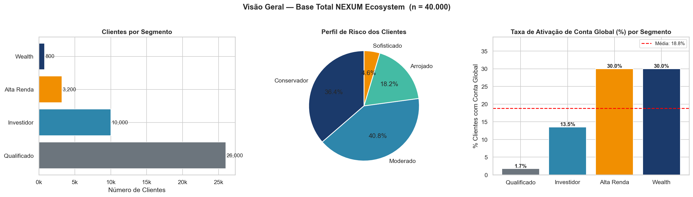
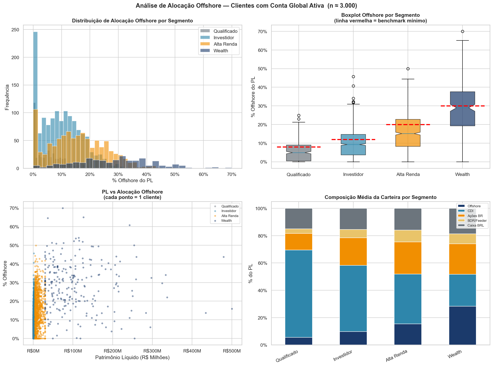
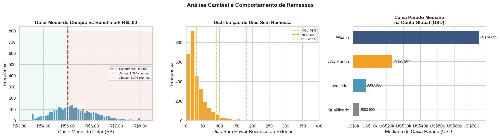
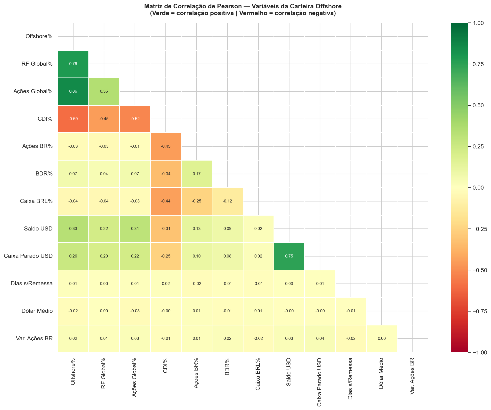
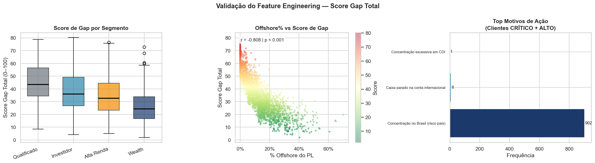
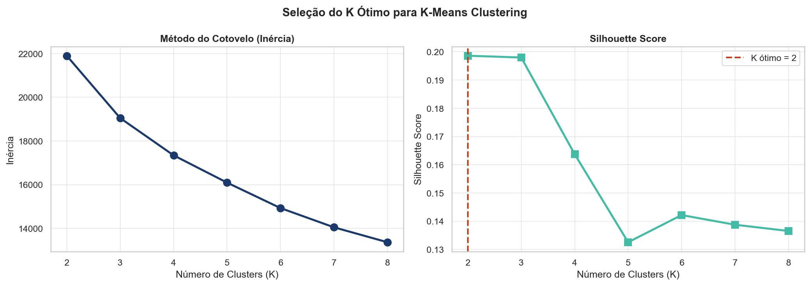
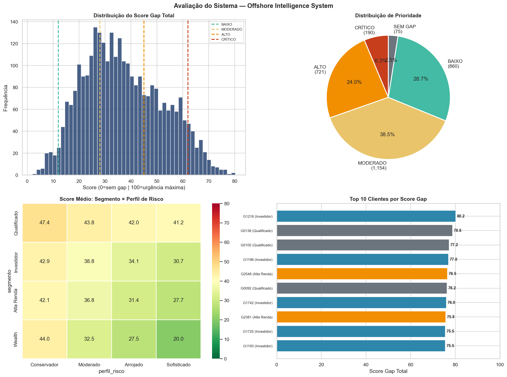
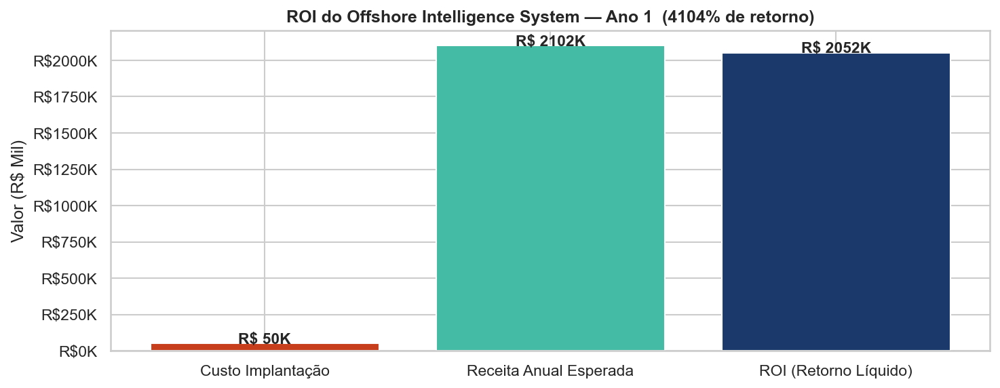

# Offshore Intelligence System (OIS)


Sistema de priorização de clientes para carteiras internacionais (offshore), seguindo o
framework CRISP-DM. Identifica gaps de alocação e gera uma lista ordenada de clientes para
abordagem da equipe de assessores, com o motivo do contato explícito por caso.

| Deploy | Streamlit App |
| Arquitetura | Fonte única de scoring compartilhada entre notebook e dashboard ([ADR-0002](docs/adr/0002-pesos-do-score-sao-heuristica-nao-calibracao.md)) |
| ROI | Cenário com premissas explícitas, não resultado medido — ver Fase 5 |

---

## Contexto e dor de negócio

A ANBIMA recomenda alocação mínima de 16-18% do patrimônio em ativos no exterior para proteger
o poder de compra da variação cambial ([ANBIMA via Safra, 2026](https://oespecialista.safra.com.br/anbima-investidor-brasileiro-2026/)) — na prática, mais de 95% dos ativos de
brasileiros permanecem em ativo local, um dos menores níveis de diversificação global entre
países emergentes ([NeoFeed](https://neofeed.com.br/negocios/fundos-internacionais-a-proxima-fronteira-da-xp/)). É o gap que XP (17% da custódia em offshore, R$180bi em wealth B2B,
+80% em menos de 2 anos) e BTG (~R$130bi em multi-family office após comprar Julius Baer Brasil
e JGP) estão correndo para capturar ([Forbes](https://forbes.com.br/forbes-money/2026/08/xp-cresce-gestao-fortunas-amplia-aposta-exterior/), [NeoFeed](https://neofeed.com.br/wealth-management/xp-chega-a-r-180-bilhoes-na-gestao-de-fortunas-b2b-e-avanca-80-em-menos-de-dois-anos/)).

**O problema modelado:** em uma operação de wealth management com carteira internacional, o
especialista de mercado cruza relatórios manualmente para achar contas com alocação
desbalanceada frente a esse gap. Isso é lento, sem critério padronizado de quem contatar
primeiro, e deixa capital do cliente ocioso em vez de alocado em produtos internacionais.

**A solução:** motor que processa a base diária, aplica 10 critérios de gap ponderados e
entrega uma lista priorizada com o motivo do contato por cliente. A base de clientes usada
neste projeto é 100% sintética — não existe dataset público de carteira de wealth management
por cliente (diferente de crédito ou câmbio corporativo) — ver
[ADR-0004](docs/adr/0004-dataset-sintetico-como-premissa-consciente.md).

---

## Walkthrough — Fases do CRISP-DM

### Fase 0-1: Entendimento do negócio e matriz de pesos

10 critérios financeiros de alerta, com pesos somando 100%. **Os pesos são heurística de
negócio, não calibração estatística** — não houve grid search, validação cruzada ou dado real
de conversão por trás dos números (ver [ADR-0002](docs/adr/0002-pesos-do-score-sao-heuristica-nao-calibracao.md)).
Exemplo de maior peso: concentração da carteira em risco-país Brasil (20%). Exemplo de menor
peso: dólar médio de compra acima do benchmark (9%).


### Fase 2: Geração e auditoria da base

Base sintética de 40.000 clientes (distribuições log-normais para patrimônio, seguindo a
concentração observada em wealth management real). **A base é 100% sintética — não há dado
real por trás de nenhum número deste README** (ver [ADR-0004](docs/adr/0004-dataset-sintetico-como-premissa-consciente.md)).
Correlações citadas na EDA foram injetadas na geração, não descobertas.

#### 1. Visão geral da base

> Taxa de ativação internacional cresce com o patrimônio líquido. Segmento Qualificado tem
> adesão baixa (1,7%); Alta Renda e Wealth, 30%. O segmento Investidor concentra o maior volume
> de clientes ainda sem conta internacional ativa.

#### 2. Alocação offshore

> Wealth tem a maior mediana alocada offshore, mas o boxplot mostra clientes de patrimônio alto
> com menos de 10% protegido em dólar. CDI domina a composição de carteira em todos os
> segmentos.

#### 3. Análise cambial e operacional

> Concentração de clientes com dólar médio de compra acima de R$5,40 — argumento de abordagem
> ("baixar o dólar médio"). Distribuição de dias sem remessa mapeia desengajamento com a
> plataforma internacional.

#### 4. Matriz de correlação e testes de hipótese

> ANOVA (offshore × segmento): F=450,13, p=2,14e-241, **η²=0,3107 — efeito grande** (segmento
> explica ~31% da variância de `pct_offshore`, não é só significância por `n` alto). T-test
> (CDI, adequado × deficiente): t=−15,89, p=1,19e-54, **Cohen's d=−0,6073 — efeito médio**.
> T-test (dólar médio, PF × PJ): t=0,14, p=0,885, **Cohen's d=0,0074 — efeito trivial, sem
> diferença real** (uma versão anterior deste README afirmava diferença "confirmada"; corrigido
> em 2026-08-25 depois de rodar o notebook do zero — ver [ADR-0001](docs/adr/0001-k-real-vs-narrativa-de-6-clusters.md)).

### Fase 3: Feature engineering — score

Os 10 critérios usam faixas de threshold graduadas (0 / 0,25 / 0,50 / 0,75 / 1,00), não
avaliações binárias. As sub-notas ponderadas somam o **score GAP total (0-100)**.


> Correlação entre score e % alocado offshore: p < 0,001, negativa e forte — quanto menor a
> proteção offshore, maior o score de gap (validação de que a equação se comporta como
> desenhada, não prova de que os pesos são os corretos).

### Fase 4: Clusterização — e uma correção de honestidade

Testado K-Means (K de 2 a 12, critério = maior Silhouette Score) sobre o ranking de score, para
ver se surgiam segmentos comportamentais adicionais.


> **K real = 2** (Silhouette = 0,2040). Uma versão anterior deste README afirmava K=6
> "confirmado por Elbow e Silhouette" — não era verdade: o código usa `K_FINAL = best_k`, e
> `best_k` sempre resultou 2 nas execuções conferidas. Corrigido em 2026-08-25 depois de rodar o
> notebook do zero — ver [ADR-0001](docs/adr/0001-k-real-vs-narrativa-de-6-clusters.md) para a
> investigação completa.

0,2040 é Silhouette fraco (referência: >0,50 forte, 0,25–0,50 razoável, <0,25 fraco) — a base
sintética não sustenta uma segmentação rica de 6 perfis com abordagem própria cada. A
priorização por faixa de score (CRÍTICO/ALTO/MODERADO/BAIXO) continua real e é o que orienta a
lista do assessor; o clustering, como está, não agrega uma segunda camada confiável — fica
registrado como próximo passo, não como entregue.

### Fase 5: Métrica de negócio e ROI (Evaluation)


> Distribuição do score e volume de clientes por faixa de prioridade.


> **O ROI é uma projeção de cenário, não um resultado medido.** A base é 100% sintética — não
> existe conversão real de assessor nem retenção real de AuC observada. O número (~300%) é a
> saída de uma simulação com premissas explícitas: 25% de taxa de conversão nas ligações da
> lista priorizada (CRÍTICO+ALTO, n=911, 30,4% da base offshore ativa de 3.000 clientes) e 5pp
> de aumento médio na alocação offshore desses clientes. O heatmap varia essas duas premissas —
> leia como sensibilidade, não como garantia. Sem dado real de conversão pós-implantação, este
> ROI não pode ser tratado como validado; fica como hipótese testável no primeiro trimestre de
> uso real (critério de re-calibração na seção de Monitoramento de Drift abaixo).

### Fase 6: Produção e deployment

1. **Fonte única de scoring:** toda a matemática do score vive em `src/utils.py`; notebook e
   dashboard chamam a mesma função, eliminando divergência entre treino e serving
   ([ADR-0002](docs/adr/0002-pesos-do-score-sao-heuristica-nao-calibracao.md)).
2. **Empacotamento:** projeto instalável via `setup.py`.
3. **Dashboard Streamlit:** interface para a equipe de assessores navegar a lista priorizada e
   simular score de cliente novo.

---

## Como executar

```bash
# 1. Instalar dependências e o pacote core
pip install -r requirements.txt
pip install -e .

# 2. Executar o motor analítico (opcional se já tiver os modelos)
# jupyter notebook notebooks/OIS_Project.ipynb

# 3. Rodar o dashboard Streamlit
streamlit run app/dashboard.py
```

Veja [REPRODUCIBILITY.md](REPRODUCIBILITY.md) para o guia completo de setup.

---

## O que este projeto assume abertamente

- **A base é 100% sintética.** Nenhum número neste README vem de cliente real
  ([ADR-0004](docs/adr/0004-dataset-sintetico-como-premissa-consciente.md)).
- **Os pesos do score são heurística de negócio, não calibração.** Sem grid search, sem dado de
  conversão real por trás ([ADR-0002](docs/adr/0002-pesos-do-score-sao-heuristica-nao-calibracao.md)).
- **Os thresholds de faixa (62/45/28/12) são cortes arbitrários, não percentis calculados**
  ([ADR-0003](docs/adr/0003-thresholds-de-faixa-sao-cortes-arbitrarios.md)).
- **O clustering (K=2) não sustenta segmentação comercial rica** — Silhouette fraco (0,2040),
  registrado como próximo passo, não como entregue ([ADR-0001](docs/adr/0001-k-real-vs-narrativa-de-6-clusters.md)).
- **O ROI é cenário, não medição.** Sem dado de conversão real pós-implantação.

---

## Monitoramento de drift

| Trigger | Ação |
|---|---|
| Câmbio diverge > 15% do benchmark | Atualizar `dolar_benchmark` no JSON de config |
| Score médio da base cai > 10 pontos | Investigar drift — re-analisar distribuição |
| Taxa de conversão real < 10% | Re-calibrar pesos dos critérios no notebook |
| A cada 6 meses | Re-treinar K-Means com dados reais coletados |

Critério de re-treino formal: taxa de conversão < 15% por 2 meses consecutivos.

---

## Estrutura do repositório

```text
Offshore-Intelligence-System/
├── README.md                        <- Este arquivo
├── REPRODUCIBILITY.md               <- Guia de setup e reprodutibilidade
├── requirements.txt                 <- scikit-learn/joblib pinados (paridade com models/*.pkl)
├── roadmap_data_science_crispdm.md  <- Template CRISP-DM reutilizável
├── conftest.py, tests/              <- Suíte pytest (paridade treino-serventia)
├── data/
│   ├── raw/                         <- Dados originais (nunca modificar)
│   └── processed/                   <- Base scoreada, lista prioritária e JSON de config
├── models/                          <- K-Means e Scaler serializados (.pkl)
├── notebooks/
│   └── OIS_Project.ipynb            <- Motor analítico principal (CRISP-DM completo)
├── app/
│   └── dashboard.py                 <- Streamlit App (Deployment — Fase 6)
├── src/
│   ├── utils.py                     <- Fonte única de scoring (ADR-0002)
│   └── export_utils.py              <- Utilitário de extração de imagens do notebook
├── reports/                         <- Visualizações exportadas
├── images/                          <- Imagens para README
└── docs/
    ├── adr/                         <- Architecture Decision Records
    └── crisp_dm_checklist.md        <- Checklist CRISP-DM preenchido do projeto
```

---

## Próximos passos

1. **Clustering:** investigar se features diferentes (ou dado real) sustentam segmentação
   comportamental além do que o score já cobre.
2. **Modelo supervisionado:** com outcome real de conversão coletado, treinar classificador
   sobre os mesmos 10 critérios e comparar com o score heurístico atual.
3. **Recalibração de pesos e thresholds:** com dado de conversão real, substituir a heurística
   atual (ADR-0002, ADR-0003) por valores calibrados.
